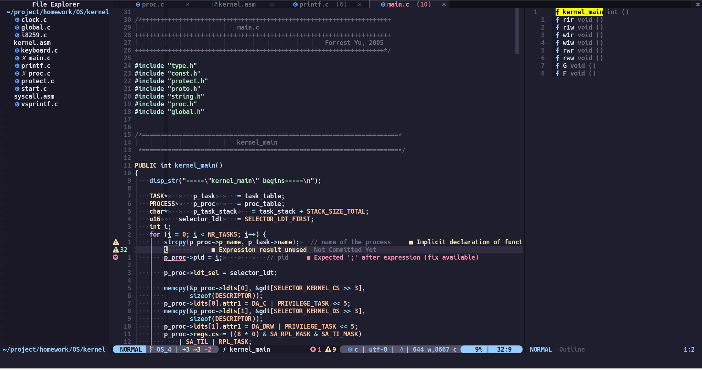
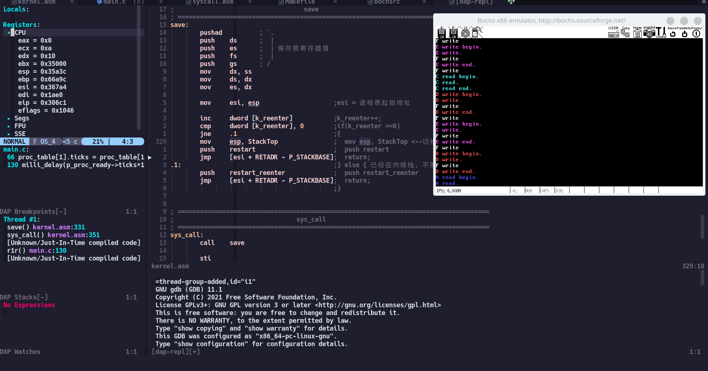
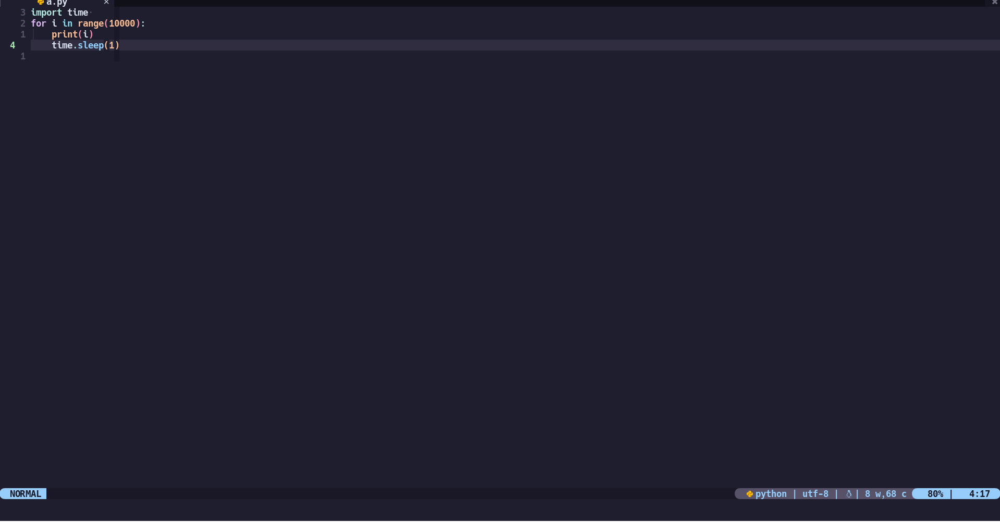

# Install
`git clone --recursive git@github.com:ayasa520/nvimdots.git ~/.config/nvim`

# Introduction

Dashboard

 

Telescope

 

Coding

 

Debugging

 

Async Quick Run

 

Code completion

 

Packer

 

This is my neovim's configuration, which contains four branch.

I use [packer.nvim](https://github.com/wbthomason/packer.nvim) to manage plugins.

| Branch |   Completion Solution   |
| :----: | :---------------------: |
|  main  | nvim-lspconfig+nvim-cmp |
|  coq   | nvim-lspconfig+coq_nvim |
|  coc   |        coc.nvim         |

Chinese introduction is [here](https://zhuanlan.zhihu.com/p/382092667).

**Pros**:

- Fast. Less than **50ms** to start(Depends on SSD, tested on Sumsung 970 evo).
- Simple. Run out of the box.
- Modern. Pure lua to config.
- Modular. Easy to customize.
- Powerful. Full functionality to code.

(Tested with [rhysd/vim-startuptime](https://github.com/rhysd/vim-startuptime))

# Details

Please refer to [wiki](https://github.com/ayamir/nvimdots/wiki).

# Acknowledgement

- [glepnir/nvim](https://github.com/glepnir/nvim)
