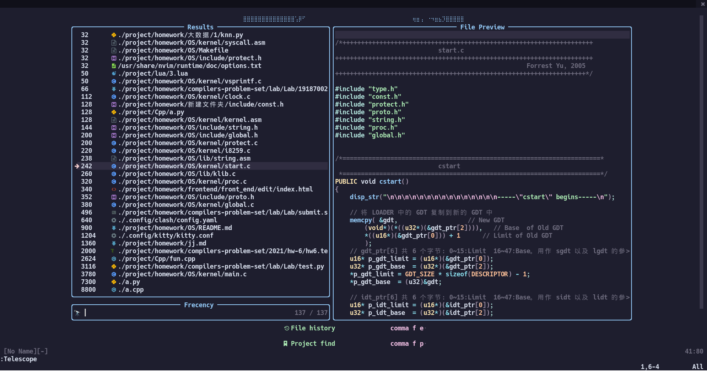
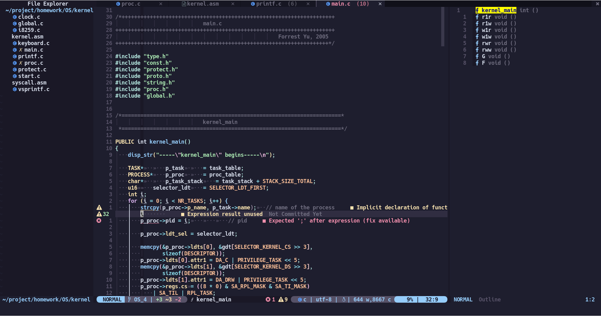
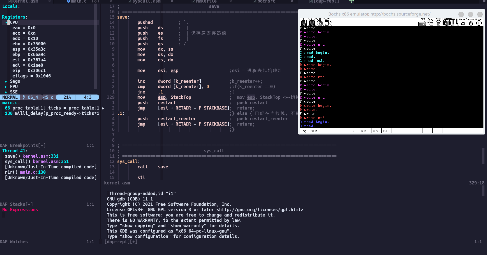
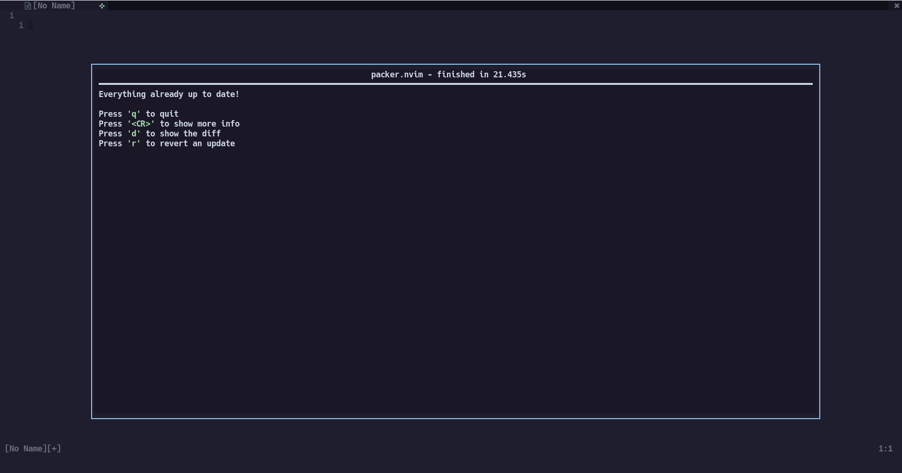

# 使用这个配置
`git clone --recursive git@github.com:ayasa520/nvimdots.git ~/.config/nvim`

# 介绍

这是我 fork 的 [ayamir](https://github.com/ayamir/nvimdots) 的配置, 我只使用 main 分支. 使用 packer.nvim 管理插件

| Branch |   Completion Solution   |
| :----: | :---------------------: |
|  main  | nvim-lspconfig+nvim-cmp |
|  coq   | nvim-lspconfig+coq_nvim |
|  coc   |        coc.nvim         |

ayamir 知乎上的介绍 [here](https://zhuanlan.zhihu.com/p/382092667).

**优势**:

- 快速. 启动速度在 50ms 左右(在SAMSUNG MZVLB1T0HBLR测试)
- 简便. 开箱即用(但是需要安装一些依赖, 详见 ayamir 的 [wiki](https://github.com/ayamir/nvimdots/wiki).
- 现代化. 完全由 Lua 配置.
- 模块花. 自定义友好.
- 功能强大 . 拥有编码的完整功能.

(Tested with [rhysd/vim-startuptime](https://github.com/rhysd/vim-startuptime))

# 更多详细内容

参考 [wiki](https://github.com/ayamir/nvimdots/wiki).

# 感谢

- [glepnir/nvim](https://github.com/glepnir/nvim)
- [ayamir/nvim](https://github.com/ayamir/nvimdots) 
